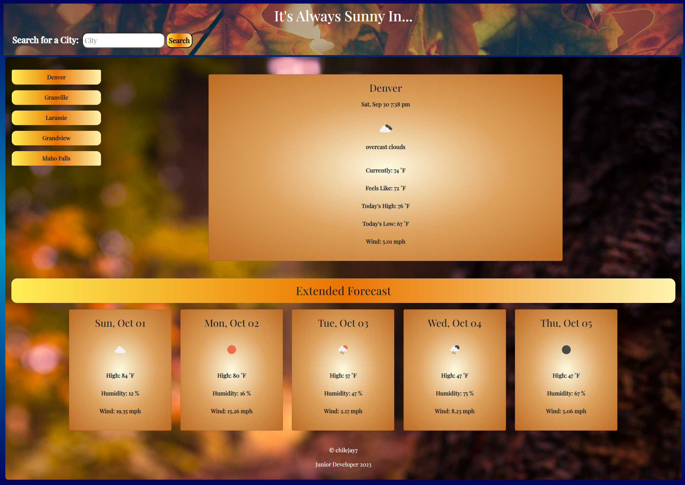

# It's Always Sunny in...

## Description

A client who travels often requested a weather application that was capable of providing the forecast for a given location in order to better plan trips.  When searching for a city, the current and future weather conditions would be provided.  A five day forecast was required when building an application that would fulfill the client's needs.  Locations searched also needed to be stored to easily be recalled on-demand when needed.  The Open Weather API was used to provide the weather conditions data needed to fulfill the application's requirements.

## Website URL

https://chilejay7.github.io/Its-Always-Sunny-in.../

## Usage

A screenshot of the application has been included below for reference. A city can be entered in the header's search field.  Submitting a search triggers the event listener on the form.  The event will call two functions: the first will retrieve the current weather, and the second provides conditions for the following five days.  The functions for current and future conditions are separated because two different URL's have been used.  The Open Weather API allows for a call that will provide more detailed information for the current date.  The URL utilized for the future conditions does not provide nearly as many data points.  Maintaining a separation and building the separate function for current conditions will provide for a much easier upgrade process during future iterations if additional data points are requested.

The locations searched are also passed to an array that is written to local storage.  The city's value is written to a corresponding button that can be clicked to trigger the same forecast functions used in the submit event.  Clicking on any of the buttons with a named location will retrieve its forecast data.  The previous locations are retrieved from storage and written to the buttons when the page loads.  The number of locations is currently set at five.  If the limit is reached, the oldest entry in the array will be removed in favor of the new search location.

## Credits

N/A

## License

Please refer to the LICENSE in the repo for further information.